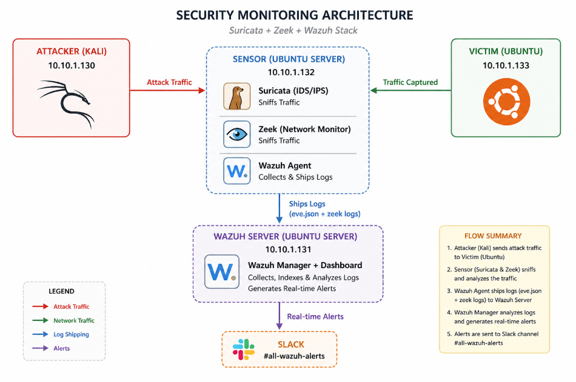
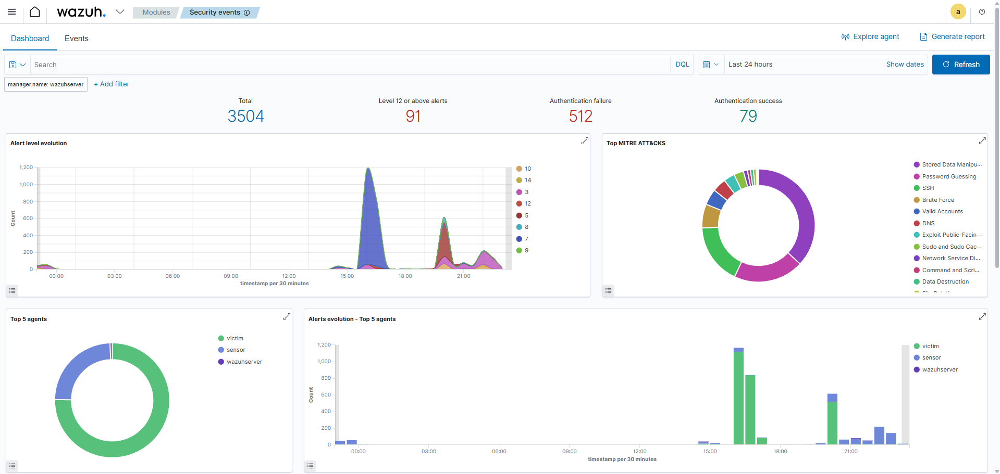
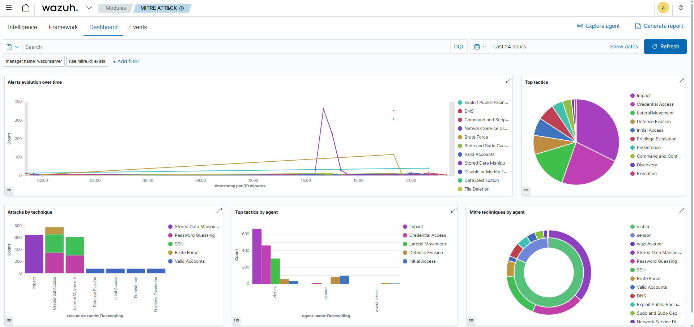
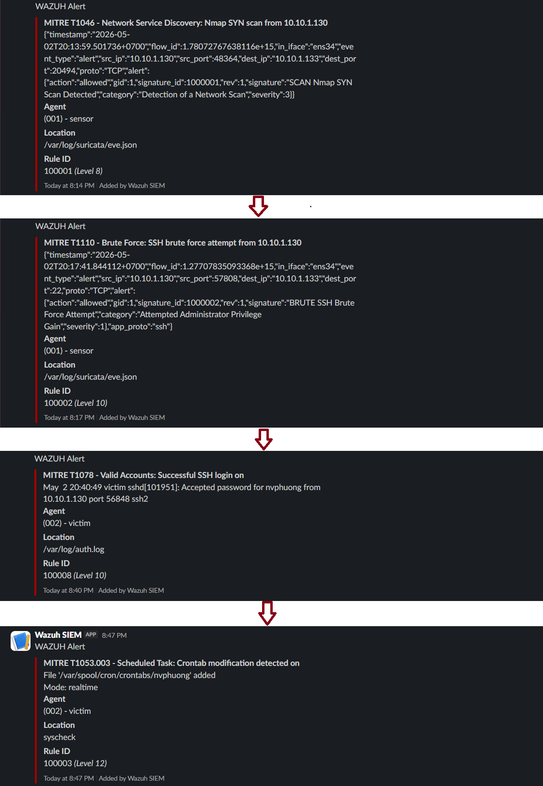
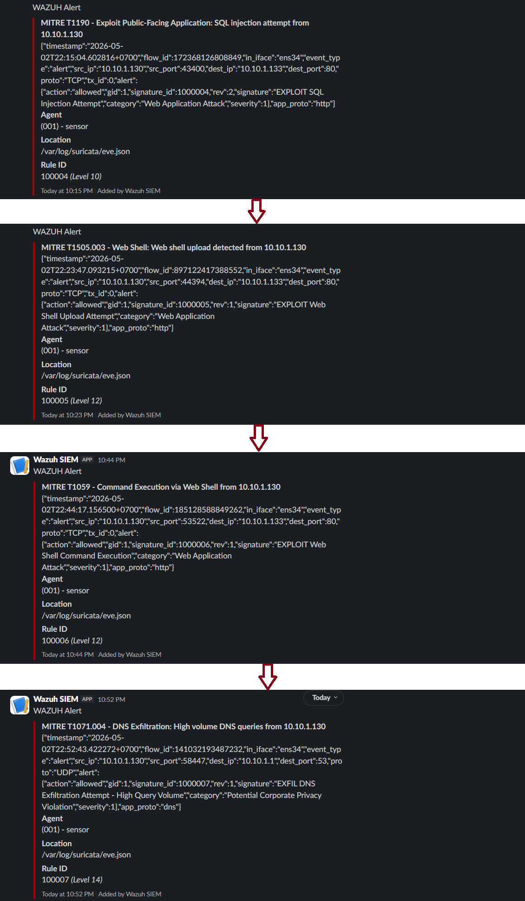

# 🛡️ Network & Host Intrusion Detection Lab


A full-spectrum intrusion detection lab combining **Network IDS** (Suricata + Zeek) and **Host IDS** (Wazuh) to detect multi-stage attack campaigns — mirroring how a real SOC operates.

> Unlike single-layer detection labs, this project correlates **network-level signals** (packet inspection) with **host-level signals** (file integrity, log analysis) to trace an attacker's full kill chain from initial reconnaissance to data exfiltration.

---

## 📌 Architecture

```
Attacker (Kali)  ──────────────────────────────────────────►  Victim (Ubuntu)
10.10.1.130                                                    10.10.1.133
                                                               │
                          Sensor (Ubuntu Server)               │
                          10.10.1.132                          │
                          ├── Suricata  ◄── sniffs traffic ────┤
                          ├── Zeek     ◄── sniffs traffic ────┘
                          └── Wazuh Agent
                                    │
                                    │  ships eve.json + zeek logs
                                    ▼
                          Wazuh Server (Ubuntu Server)
                          10.10.1.131
                          └── Wazuh Manager + Dashboard
                                    │
                                    │  real-time alerts
                                    ▼
                               Slack #all-wazuh-alerts
```



---

## 🧰 Stack

| Component | Role | Version |
|-----------|------|---------|
| Suricata | Network IDS — packet inspection, custom rules | 6.0.4 |
| Zeek | Network metadata — conn/dns/http logs | 8.0.5 |
| Wazuh Manager | SIEM — log aggregation, correlation, alerting | 4.7.5 |
| Wazuh Agent | Host monitoring — FIM, log collection | 4.7.5 |
| Slack | Real-time alert notification | — |

---

## 🖥️ Lab Environment

| Machine | OS | IP | Role |
|---------|----|----|------|
| Wazuh Server | Ubuntu Server 22.04 | 10.10.1.131 | SOC HQ — Wazuh Manager + Dashboard |
| Sensor | Ubuntu Server 22.04 | 10.10.1.132 | Network monitor — Suricata + Zeek |
| Victim | Ubuntu Desktop 22.04 | 10.10.1.133 | Target — Apache + DVWA + Wazuh Agent |
| Attacker | Kali Linux | 10.10.1.130 | Adversary simulation |

---

## ⚔️ Attack Chains & Detection Coverage

### Chain 1 — SSH Intrusion & Persistence

| Step | Technique | MITRE ID | Detection Source | Rule |
|------|-----------|----------|-----------------|------|
| Port Scan | Network Service Discovery | T1046 | Suricata | 100001 |
| SSH Brute Force | Brute Force | T1110 | Suricata | 100002 |
| Successful Login | Valid Accounts | T1078 | Wazuh | 100008 |
| Crontab Backdoor | Scheduled Task/Job | T1053.003 | Wazuh FIM | 100003 |

→ [Full walkthrough with evidence](docs/attack-chain-1.md)

### Chain 2 — Web Compromise & Data Exfiltration

| Step | Technique | MITRE ID | Detection Source | Rule |
|------|-----------|----------|-----------------|------|
| SQL Injection | Exploit Public-Facing App | T1190 | Suricata | 100004 |
| Web Shell Upload | Server Software Component | T1505.003 | Suricata | 100005 |
| Remote Code Execution | Command and Scripting | T1059 | Suricata | 100006 |
| DNS Exfiltration | Application Layer Protocol | T1071.004 | Suricata | 100007 |

→ [Full walkthrough with evidence](docs/attack-chain-2.md)

---

## 🔍 Key Differentiators

**Cross-layer detection** — Suricata catches the network footprint while Wazuh FIM catches the host-level impact of the same attack. Two independent signals, one correlated incident.

**Real pipeline** — Suricata `eve.json` and Zeek logs are shipped into Wazuh via the agent, creating a single pane of glass for the analyst.

**MITRE-mapped custom rules** — Every detection rule is tagged with a MITRE ATT&CK technique ID and tactic, visible directly in the Wazuh dashboard.

**Active Response** — Wazuh automatically blocks attacker IPs via `iptables` upon detecting brute force or web shell activity.

**Real-time Slack alerting** — Critical alerts (level ≥ 8) are pushed to Slack with rule ID, MITRE technique, agent name, and timestamp.

---

## 📊 Wazuh Dashboard





---

## 💬 Slack Alerts
**Slack Alert Chain 1**


</br>

**Slack Alert Chain 2**


---

## 📁 Repository Structure

```
network-host-ids-lab/
├── README.md                     # This file
├── docs/
│   ├── architecture.png          # Lab topology diagram
│   ├── attack-chain-1.md         # SSH intrusion walkthrough
│   └── attack-chain-2.md         # Web compromise walkthrough
├── suricata/
│   ├── local.rules               # Custom detection rules (annotated)
│   └── suricata.yaml             # Relevant config excerpts
├── wazuh/
│   ├── ossec.conf                # Relevant Wazuh config excerpts
├── attacks/
│   ├── chain-1-ssh/
│   │   ├── playbook.md           # Step-by-step attack commands
│   │   └── screenshots/
│   └── chain-2-web/
│       ├── playbook.md           # Step-by-step attack commands
│       └── screenshots/
└── alerts/
    ├── slack-notifications/
    └── wazuh-dashboard/
```

---

## 🧠 What I Learned

**Network vs Host visibility gap** — Suricata sees the wire but not the disk. Wazuh sees the disk but not the wire. Running both exposed blind spots that neither tool covers alone. For example, a successful SSH login after brute force only becomes a confirmed incident when Suricata's T1110 alert is correlated with Wazuh's T1078 login event.

**Threshold tuning is critical** — My initial DNS exfiltration rule triggered on normal Wazuh Manager DNS traffic (false positive). Tuning the threshold from 10 to 30 queries/60s and filtering by source IP reduced noise significantly.

**Wazuh FIM realtime mode** — Setting `realtime="yes"` on monitored directories makes a huge difference. Without it, crontab changes would only be detected on the next scheduled scan (every 5 minutes), not immediately.

---

## ⚡ Challenges & Solutions

| Challenge | Solution |
|-----------|----------|
| Wazuh Agent version mismatch (4.14 vs Manager 4.7) | Pinned agent install to `wazuh-agent=4.7.5-1` |
| Suricata `eve.json` "Too many fields" error in Wazuh | Switched to Wazuh built-in Slack integration instead of custom script |
| DNS exfil traffic not captured by Suricata | Targeted DNS queries to an in-lab IP (10.10.1.131) so traffic stays on the monitored interface |
| Zeek not in PATH after install | Added `/opt/zeek/bin` to `~/.bashrc` |
| Wazuh FIM not detecting crontab changes | Changed monitored path from `/var/spool/cron` to `/var/spool/cron/crontabs` |

---

## 🔗 Real-World References

- **T1110 Brute Force** — [2024 Verizon DBIR](https://www.verizon.com/business/resources/reports/dbir/): credential attacks remain the #1 initial access vector
- **T1505.003 Web Shell** — Used in [HAFNIUM Exchange Server attacks (2021)](https://www.microsoft.com/security/blog/2021/03/02/hafnium-targeting-exchange-servers/)
- **T1071.004 DNS Exfiltration** — Technique used by APT groups including OilRig/APT34
